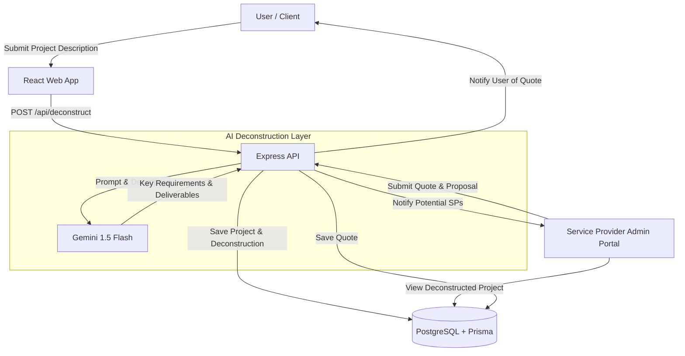

# QuoteMe - System Map

This document outlines the data flow and system architecture for the QuoteMe platform.

## Data Flow Diagram

## Component Breakdown

### 1. User Form (Frontend)
- **Tech**: React, Framer Motion, Tailwind CSS.
- **Role**: Collects project requirements from the user in a natural language format.

### 2. AI Deconstruction Layer (Backend)
- **Tech**: Gemini 1.5 Flash (via Google Generative AI SDK).
- **Role**: Takes raw project descriptions and transforms them into structured data (deliverables, milestones, technical requirements). This makes it easier for Service Providers to provide accurate quotes.

### 3. Service Provider Admin Portal
- **Tech**: React (shared with main web app).
- **Role**: Allows Service Providers to browse projects, view AI-suggested deconstructions, and submit tailored quotes.

## Deployment & Secrets (GCP)

### 1. Google Cloud Secrets Manager
Configure the following secrets in GCP:
- `DATABASE_URL`: The connection string for the PostgreSQL instance.
- `GEMINI_API_KEY`: API key for accessing Google Generative AI services.

### 2. Cloud Run / GKE
- Both the **API** and **Web** layers can be deployed as Docker containers.
- The API should have environment variables mapped to Secrets Manager values.
